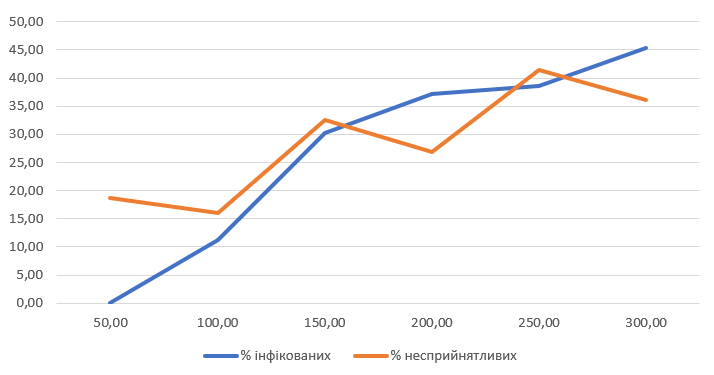

## Комп'ютерні системи імітаційного моделювання
## СПм-22-5, **Бондар Олег Володимирович**
### Лабораторна робота №**1**. Опис імітаційних моделей та проведення обчислювальних експериментів

 

### Варіант 3, Модель поширення захворювання у людській популяції.:
[Virus](http://https://www.netlogoweb.org/launch#https://www.netlogoweb.org/assets/modelslib/Sample%20Models/Biology/Virus.nlogo)

 

### Вербальний опис моделі:
Ця модель імітує передачу та збереження вірусу в людській популяції. Модель ініціалізована деякою кількістю людей, з яких 10 заражені. Люди випадково пересуваються по світу в одному з трьох станів: здорові, але сприйнятливі до інфекції (зелений), хворі та інфекційні (червоний) і здорові та імунні (сірий). Люди можуть померти від інфекції або старості. Коли популяція падає нижче "пропускної здатності" середовища (встановленої на рівні 300 у цій моделі), здорові люди можуть народжувати здорове потомство.

### Керуючі параметри:
- **number-people**: визначає кількість агентів у середовищі моделювання, тобто, в даній моделі, кількість людей.
- **infectiousness**: визначає ймовірнінсть, що хвора людина заразить інших людей у тому самому місці. Це параметр, який визначає ймовірність передачі інфекції від зараженої людини сприйнятливій людині, коли вони знаходяться в безпосередній близькості.
- **chance-recover**: визначає вірогідність видужати і набути імунітет після зараження.
- **duration**: визначає тривалість часу у тижнях, протягом якого хвора людина має залишатися інфікованою, перш ніж вона матиме шанс або одужати та отримати імунітет, або померти від інфекції.

### Внутрішні параметри:
- **lifespan**: параметр, що визначає тривалість життя людей у моделі. У даному випадку, lifespan встановлено на 2600 тижнів, що відповідає приблизно 50 рокам.
- **chance-reproduce**: цей параметр визначає ймовірність того, що людина може створити нащадка кожного кроку симуляції, якщо популяція менше за carrying-capacity. Цей параметр встановлено в значення 1%.
- **immunity-duration**: визначає, протягом скількох тижнів залишається імунітет у людей після того, як вони відновилися від інфекції. 52 тижні - 1 рік.
- **sick?**: визначає, чи хвора людина.

### Показники роботи системи:
- який % населення є заразними, тобто хворими, інфікованими.
- який % населення має імунітет, тобто не зможе заразитись протягом року.
- скільки пройшло років.
- кількість інфікованих людей
- кількість здорових людей
- кількість людей з імунітетом
- загальна кількість людей

### Примітки:
Початкова кількість інфікованих завжди 10. Люди двигаються у випадкових напрямах.

### Недоліки моделі:
Багато параметрів у моделі, такі як ймовірності і тривалості інфекції, є статичними і не змінюються з часом. У реальних ситуаціях ці параметри можуть змінюватися відповідно до динаміки самої хвороби та реакцій на неї. Або сильно відрізнятись від людини до людини і в залежності від віку людину. Старі люди мають слабкіший імунітет і з більшою вірогідністю боліють та помирають.
Також недоліком є, що немає можливості задати початкову кількість інфікованих людей.

 

## Обчислювальні експерименти
### 1. Вплив кількості людей в популяції, а отже і щільності населення, на перебіг епідемії в популяції
Досліджується залежність кількості інфікованих людей і людей з імунітетом через рік від початку епідемії (52 такти) від числа людей у популяції.
Експерименти проводяться при 50-300 людей, з кроком 50, усього 6 симуляцій.  
Інші керуючі параметри мають значення за замовчуванням:
- **infectiousness**: 65%
- **chance-recover**: 75%
- **duration**: 20

<table>
<thead>
<tr><th>Кількість людей</th><th>% інфікованих</th><th>% несприйнятливих</th></tr>
</thead>
<tbody>
<tr><td>50</td><td>0</td><td>18,7</td></tr>
<tr><td>100</td><td>11,2</td><td>16</td></tr>
<tr><td>150</td><td>30,2</td><td>32,6</td></tr>
<tr><td>200</td><td>37,1</td><td>26,9</td></tr>
<tr><td>250</td><td>38,6</td><td>41,40</td></tr>
<tr><td>300</td><td>45,4</td><td>36,1</td></tr>
</tbody>
</table>

За цими даними видно, що при збільшенні кількості людей у популяції зазвичай збільшується і кількість інфікованих. Це досить логічно, оскільки більше людей означає більше можливих контактів і швидше поширення інфекції. Проте, при великій кількості людей (300) % інфікованих може стати меншим, оскільки частина популяції набуде імунітет.
З кількістю несприйнятливих (людей з імунітетом) ситуація складніша. Хоча зазвичай більше людей призводить до більшої кількості несприйнятливих, але ця залежність не є прямою. Наприклад, при 200 людях % несприйнятливих менше, ніж при 100 або 250 людях. Це може бути пов'язано з іншими факторами, такими як швидкість інфекції та швидкість одужання.

### 2. Перевірка гіпотези про те, що початкове розміщення машин на трасі не впливає на ефективність руху
...  
*// це як раз один з експериментів, що рекомендовано автором моделі. Але без корегування внутрішньої логіки моделі виконати таке дослідження неможливо - тобто таке можна розглядати у другій л/р. А у першій, найпростішим рішенням було б розглянути залежність швидкості від ступеня гальмування - аналогічно тому, як виконувалось дослідження у першому експерименті.*
### 3. Підбір значень параметрів deceleration та acceleration для уникнення пробок на трасі
...  
*// також одне з цікавих досліджень, але не у контексті першої лабораторної роботи. Бо без засобів автоматизації це буде лише ручний перебір (у якому ніякої науки) можливих комбінації значень, яких дуже багато навіть для такій примітивній моделі. Такий експеримент був би доцільним у третій л/р, яка присвячена як раз підбору параметрів - тобто завданню оптимізації моделей. А у першій л/р, при виборі дослідження для третього експерименту, найпростішим рішенням було б діяти за аналогією з попередніми - і розглянути залежність середньої швидкості від значення прискорення.*
